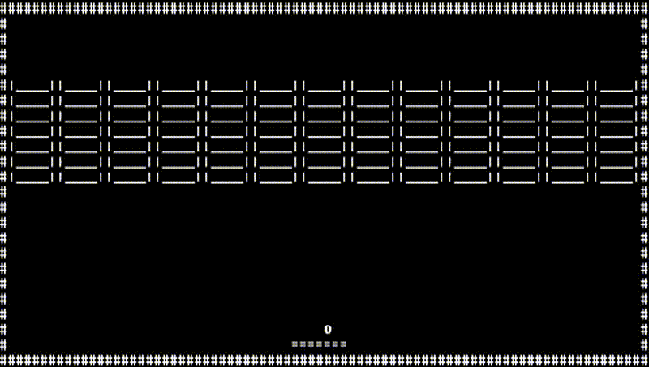
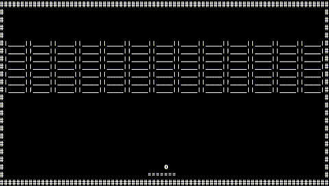

# ASCII Breakout

An implementation of the classic Atari 2600 game, Breakout, using ASCII characters. This project explores how language models interpret ASCII representations of game states to generate viable gameplay actions. Inspired by [Atari-GPT](https://arxiv.org/abs/2408.15950), this approach utilizes ASCII art instead of graphical frames to represent the game state.

## Features

- ASCII-based representation of the classic Breakout game.
- Integration with language models (GPT-4o, Gemini Pro, Gemini Flash, Llama 3.2 3B) to interpret game states and generate actions.
- Performance comparison between different models.

## Performance

### NEW RESULTS:

- **GPT-4o:** Using the updated ball collision performance was increased! Here is the Gameplay:


### OLD RESULTS:
Two comprehensive 1,000 step tests have been conducted using Llama 3.2 3B and OpenAI's GPT-4o models:

- **Llama 3.2 3B:** Demonstrated reasonable performance at the beginning but shortly started to only provide left or right actions without aligning with the ball. Here is the Gameplay:


- **GPT-4o:** Exhibited more effective gameplay, successfully breaking multiple bricks at the beginning then barely missing the ball on several occasions. Here is the Gameplay:



- **Gemini Flash 2.0:** Showed promising initial results in breaking bricks, more results coming soon. Here is the Gameplay:



_(Note: Gemini Pro 2.5 is also supported, but performance results are not yet available due to computational costs.)_

## Installation

1. Clone the repository:

   ```
   git clone https://github.com/Dev1nW/ASCII_Breakout.git
   cd ASCII_Breakout
   ```

2. Create and activate a virtual environment:

   ```
   conda create -n ascii_breakout python=3.9
   conda activate ascii_breakout
   ```

3. Install the required dependencies:

   ```
   pip install -r requirements.txt
   ```

## Setup

To run this code, you will need to obtain API keys and save them in the project root directory:

- **OpenAI API Key:** Sign up at [OpenAI](https://openai.com/), then navigate to the API keys section to create a new key. Save your key in a file named `OPENAI_API_KEY.txt`.
- **Hugging Face API Key:** Create an account at [Hugging Face](https://huggingface.co/), then go to your account settings to generate a new API token. Save your key in a file named `HG_API_KEY.txt`.
- **Google API Key:** Sign up at [Google AI Studio](https://ai.google.dev), then navigate to the API keys section to create a new key. Save your key in a file named `GOOGLE_API_KEY.txt`.

## Usage

1. Run the main script using a command-line argument to specify the model:

   ```
   python breakout_ascii.py --model <model_name>
   ```

   Replace `<model_name>` with one of the following:
   - `gpt4o`
   - `geminipro`
   - `geminiflash`
   - `llama`

   For example, to use GPT-4o:
   ```
   python breakout_ascii.py --model gpt4o
   ```

2. **Execution:**

   After selecting a model, the script will initiate a 1,000 step simulation where the chosen language model determines the gameplay actions at each step. During this process:

   - All model outputs are saved in `all_responses.txt`.
   - Upon completion, a video of the performance is saved as `breakout.mp4`.
   - All actions and rewards are recorded in `actions_rewards.csv`.

## Notes

- Initial tests were conducted using Llama 3.2 1B, however, when using a 1B model it did not always follow the rule of using `<action></action>` meta-tags. I iterated over the system and user prompts however was never able to consistently get it to follow the rule until updating to the 3B model. 

- In initial testing, I noticed that sometimes the actions the model chose were not ideal for the given state. To investigate this, I asked the model to output the current state. Interestingly, both the Llama 3.2 3B and GPT-4o models gave the correct state every time and even in one case Llama 3B gave a location description in the state which was correct. Showing that the ASCII representation within the model is correct but its reasoning for choosing an action and the action chosen is incorrect.

- Performance is not directly comparable to Atari-GPT as the ASCII environment automatically shoots the ball without having to use a predefined action like in Atari-GPT. 


## Contributing

Contributions are welcome! If you have suggestions for improvements or new features, please open an issue or submit a pull request.

## Citing

If you find this helpful, feel free to cite as:
```
@misc{waytowich2024atarigptbenchmarkingmultimodallarge,
      title={Atari-GPT: Benchmarking Multimodal Large Language Models as Low-Level Policies in Atari Games}, 
      author={Nicholas R. Waytowich and Devin White and MD Sunbeam and Vinicius G. Goecks},
      year={2024},
      eprint={2408.15950},
      archivePrefix={arXiv},
      primaryClass={cs.AI},
      url={https://arxiv.org/abs/2408.15950}, 
}
```

